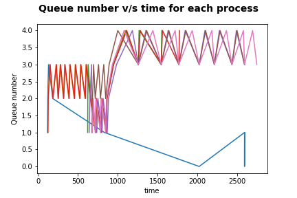

# Assignment 5

[Zeeshan Ahmed - 2019111024]

# Modification of xv6

### Features added

- waitx call
- ps (process states)
- First come first serve scheduler
- Priority based scheduler
- Multi level feedback queue scheduler

## Changes made

- Added more members to the proc structure for implementation of other features, time of creation, runtime of each process.
- Adding system call for waitx which returns the runtime and the wait time of the child process.
- Creation time is initialized to ticks when the process is started.

### Waitx

- Waitx waits for the first process which it recieves (zombie).
- Using waitx, time command was implemented as a user process which runs a given command and returns the time it took for it to run.

### ps

- Modified procdump to run ps when ^P is pressed. also ps table can be displayed using ps command.
- The suitable values are just accessed from the ptable and printed sequentially.

## Scheduler

For each scheduler there is a separate call which has the scheduler function and the trap funciton.

### FCFS

- Create time is initialized in allocproc, based on which our scheduler determines what process to run.
- Everytime there is a context switch, we pass through the whole table and find the (runnable)process which has the least creation time and runs it.
- Yielding is disabled for the timer interrupt in trap function.

### PBS

- Priority of each process is initialized to 60 when the process is created based on which the scheduler runs.
- The scheduler runs over the whole list and then finds the process with minimum priority and stores it.
- Then does a round robin over all the processes which have the priority found before.
- But since the priority can change while the round robin is happening, we also find the minimum priority after every context switch.

### MLFQ

- Each process is put into the 0th queue, and then based on the fraction of the time slot it uses, we choose to move it to the queue below it, and for each process we perform ageing where if the process has waited for too long we push it to the queue above.
- Finds the highest queue with a process in it and runs round robin on all the process presents in the queue. Also, this round robin is based on the insertion time into the queue.
- Each queue has a different size of time slice and different time of ageing. they are exponentially dependent on the queue level.

### Testing

Running a benchmark process that spawns 10 processes which are IO, CPU or both oriented. the time for each scheduler(in ticks):

- **MLFQ** - 700
- **FCFS** - 701
- **PBS** - 702
- **RR** - 702

The difference is not very noticeable since we are not using the schedulers in the best way. for greater difference we will have to use more complex processes.

### Bonus

I/O process finish early in the upper queues whereas the CPU heavy ones continue for longer into deeper queues.
